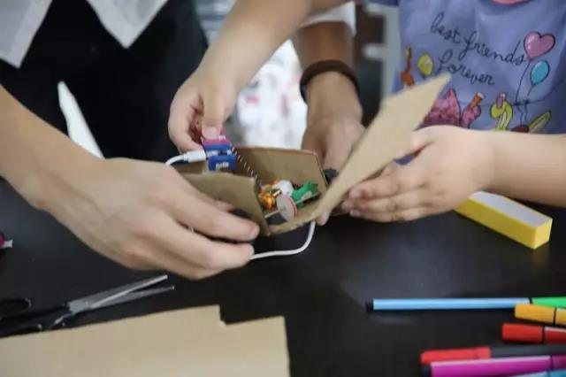

# 宁波凯思奥教育科技有限公司

    

## 公司介绍

宁波凯思奥教育科技有限公司是一家聚焦于小学生STEM创客教育的新行业公司，深受家长与市场的欢迎。我们并非传统的培训机构，而是将当代科技引入小学教育的实践者。2016年6月份年创建，与浙江大学宁波理工学院、鄞州图书馆、各小学等达成合作，拥有多个教学点。经营领域涵盖创客产品研发、创客课程研发、儿童编程、项目制作，半年的时间积累了众多的合作伙伴。

我们的团队年轻、朝气，同事都是热爱创新的研究生、大学生！ 我们的梦想是：让当代的宁波的小孩子都能享受我们的先进的科技教育。我们敬畏孩子的教育，如同注重以后自己孩子的教育。我们要让孩子享受优越的学习环境。

公司自由、充满机遇。欢迎具有创业精神的伙伴加入，我们愿意与之共创未来。

## 创作背景

现在很多大学生沉湎于游戏，缺乏求知欲，为了学而学，究其原因是因为从小学一直到高中，一直处于机械式、填鸭式教育，失去了独立思考的能力与对知识的渴望，因此在最需要学习的大学阶段麻木不堪；这也是为什么很多家长把自己的孩子送去私校和国外的本质原因。

因此，我们想**以STEM教育为载体，让他们能保持自己的兴趣，发挥自我特长，让被动式的学习变成主动式的学习，**为真正的素质教育改革贡献自己的绵薄之力。

## 核心理念

**创作**：每个孩子都有自己喜欢的一面，从他们自己喜欢的东西入手，结合知识教育能事半功倍，并从中释放天性，保持求知欲；

**逻辑**：逻辑思维是学习分析的基石，通过项目教育，结合流程图，讨论，诱导等方式，锻炼逻辑思维，提高分析问题，解决问题的能力，为其他课程学习打下基础；

**团队**：在项目教学中采用团队方式，一方面提高他们的沟通，协作能力，另一方面也通过互帮互助培养他们健康的心理，通过鼓励等享受心灵快乐！

**分享**：通过同学间、亲子间的成果分享收获快乐、亲情，为进一步学习提供原动力。

## 经营方式

以STEM课程开发与硬件产品开发为核心，为各类培训机构提供创客教育方案与师资，举办各类夏、冬令营，竞赛，公益教育活动，推广自己的STEM教育核心理念，追求多方共赢。

    

希望通过我们的实践，让每个孩子都成为一名**有求知欲、能发挥自我特点，有逻辑思维的、有团队意识的、懂得分享的人**，为他们不仅在学习、也在未来的工作和生活中提供原动力。

    

摒弃现有的复杂、价格昂贵、重复利用率低的硬件系统，以自我开发的一套无线电子为核心硬件，结合Scratch软件，从硬纸板、亚克力、3D打印一直到金属切割，提供从小学一直到中学的渐进性教学工具，实现STEM教育的低门槛、重创意、发展无限制的核心理念。

    

## 团队介绍

我们拥有专业的工学硕士团队，专业包括机械电子工程、机械制造及其自动化、电气自动化、计算机科学与技术等专业，同时聘请中小学教师和高校相关专业老师作为课程顾问。另外在浙江大学宁波理工学院的相关专业成立了STEM社团，为我们提供源源不断的大学生师资，并进行持续的STEM项目研究与创作。

## 课程理念

始终秉持着核心指导理念，深知保护孩子们的好奇心，激发他们的兴趣才是最重要的，提倡快乐教育，并保证每个小朋友都能收到老师的实时关注。

**阶段Ⅰ**

以scratch编程为基础，故事、动画、游戏创作，给予0到1的创造性，培养**兴趣**，发挥属于孩子的**创意**。

**阶段Ⅱ**

在scratch课程结合无线电子积木。我们为孩子们安排了scratch初级班、中级班、高级班、初级硬件班、以及高级硬件班，每个课程都有相应配套的项目教案。利用scratch的多创造性，给予孩子1到100的创造性，同时课程中隐含了各种学科知识。在创作中**培养逻辑能力**，在团队中培养**团队意识、分享意识**。

**阶段Ⅲ**

兴趣课。有机械，有电子，有高级编程。为喜爱机械结构设计的小朋友们开设的设计班，具体课程有平面CAD制图，激光切割、三维设计、3D打印课程。再搭配之前阶段的对编程、电子元件的学习，综合运用，做一名合格的小小创客。这个课程**给予孩子们无限的创造性**，他们可以将任何想法通过设计表达出来，最大限度的表现自己。

    

**我们承诺**

①课程安排采用小组配合与小班教学的模式，配合助教使师生比在**1:4**以上；

②授课过程中在核心内容不变的情况下，鼓励小朋友用自己的方法创作自己喜欢的东西，发挥**个性和想象力**；

③提倡**以学生为核心**，后期的课程中老师只作为课程的引导者，学生自我组织完成项目的分析、讨论、设计与调试。

## 合作机构

**浙江大学宁波理工学院**

    

**海曙区第二外国语学校**

    

**宁波图书馆**

    

**鄞州青少年宫**

    

**高桥中学**

    

**海曙区尹江岸小学**

    

## 教学成果

我们在各个合作的机构中已经进行了将近一年的科技课、scratch编程课等，教学成果也颇丰，多次改进完善课案，受到广大家长与孩子的好评。另外，我们成功举办过一期主题为“游乐园”的主题冬令营，效果非常不错，参加过冬令营的孩子们与家长也表示收获颇丰。

    

    

联系我们：+86 15724290665

地址：宁波市鄞州区学士路655号（科技信息孵化园B栋1楼）

微信公众号：凯思奥STEM创客教育

官方网站：[宁波凯思奥教育科技公司](https://k12stemaker.github.io)
